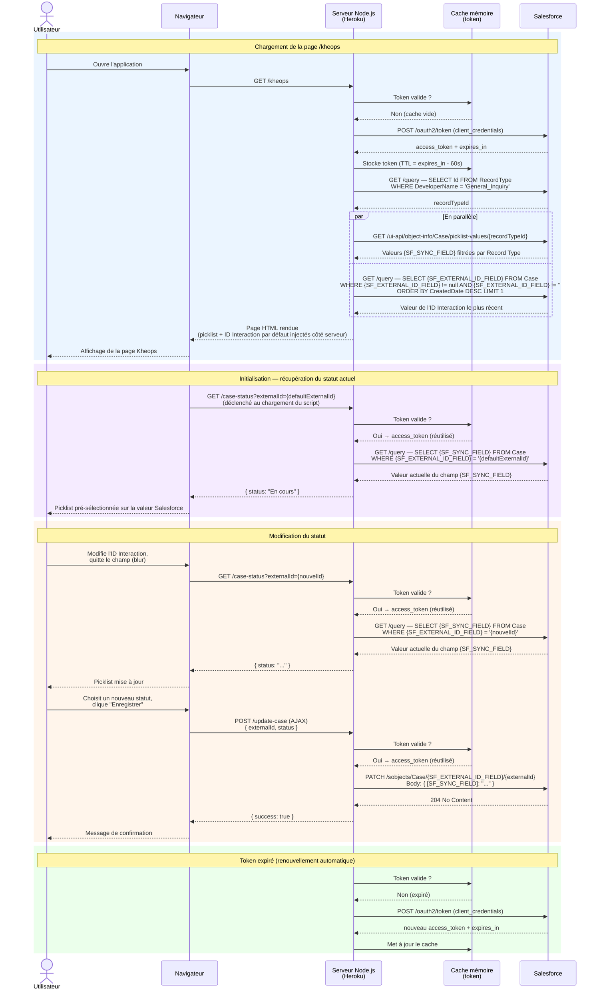

# Diagramme de séquence — Application Kheops Demo

```mermaid
sequenceDiagram
    actor User as Utilisateur
    participant Browser as Navigateur
    participant Server as Serveur Node.js<br/>(Heroku)
    participant Cache as Cache mémoire<br/>(token)
    participant SF as Salesforce

    rect rgb(235, 245, 255)
        Note over User,SF: Chargement de la page /kheops

        User->>Browser: Ouvre l'application
        Browser->>Server: GET /kheops

        Server->>Cache: Token valide ?
        Cache-->>Server: Non (cache vide)
        Server->>SF: POST /oauth2/token (client_credentials)
        SF-->>Server: access_token + expires_in
        Server->>Cache: Stocke token (TTL = expires_in - 60s)

        Server->>SF: GET /query — SELECT Id FROM RecordType<br/>WHERE DeveloperName = 'General_Inquiry'
        SF-->>Server: recordTypeId

        par En parallèle
            Server->>SF: GET /ui-api/object-info/Case/picklist-values/{recordTypeId}
            SF-->>Server: Valeurs {SF_SYNC_FIELD} filtrées par Record Type
        and
            Server->>SF: GET /query — SELECT {SF_EXTERNAL_ID_FIELD} FROM Case<br/>WHERE {SF_EXTERNAL_ID_FIELD} != null AND {SF_EXTERNAL_ID_FIELD} != ''<br/>ORDER BY CreatedDate DESC LIMIT 1
            SF-->>Server: Valeur de l'ID Interaction le plus récent
        end

        Server-->>Browser: Page HTML rendue<br/>(picklist + ID Interaction par défaut injectés côté serveur)
        Browser-->>User: Affichage de la page Kheops
    end

    rect rgb(245, 235, 255)
        Note over User,SF: Initialisation — récupération du statut actuel

        Browser->>Server: GET /case-status?externalId={defaultExternalId}<br/>(déclenché au chargement du script)

        Server->>Cache: Token valide ?
        Cache-->>Server: Oui → access_token (réutilisé)

        Server->>SF: GET /query — SELECT {SF_SYNC_FIELD} FROM Case<br/>WHERE {SF_EXTERNAL_ID_FIELD} = '{defaultExternalId}'
        SF-->>Server: Valeur actuelle du champ {SF_SYNC_FIELD}

        Server-->>Browser: { status: "En cours" }
        Browser-->>User: Picklist pré-sélectionnée sur la valeur Salesforce
    end

    rect rgb(255, 245, 235)
        Note over User,SF: Modification du statut

        User->>Browser: Modifie l'ID Interaction,<br/>quitte le champ (blur)
        Browser->>Server: GET /case-status?externalId={nouvelId}

        Server->>Cache: Token valide ?
        Cache-->>Server: Oui → access_token (réutilisé)

        Server->>SF: GET /query — SELECT {SF_SYNC_FIELD} FROM Case<br/>WHERE {SF_EXTERNAL_ID_FIELD} = '{nouvelId}'
        SF-->>Server: Valeur actuelle du champ {SF_SYNC_FIELD}

        Server-->>Browser: { status: "..." }
        Browser-->>User: Picklist mise à jour

        User->>Browser: Choisit un nouveau statut,<br/>clique "Enregistrer"
        Browser->>Server: POST /update-case (AJAX)<br/>{ externalId, status }

        Server->>Cache: Token valide ?
        Cache-->>Server: Oui → access_token (réutilisé)

        Server->>SF: PATCH /sobjects/Case/{SF_EXTERNAL_ID_FIELD}/{externalId}<br/>Body: { [SF_SYNC_FIELD]: "..." }
        SF-->>Server: 204 No Content

        Server-->>Browser: { success: true }
        Browser-->>User: Message de confirmation
    end

    rect rgb(235, 255, 235)
        Note over User,SF: Token expiré (renouvellement automatique)

        Server->>Cache: Token valide ?
        Cache-->>Server: Non (expiré)
        Server->>SF: POST /oauth2/token (client_credentials)
        SF-->>Server: nouveau access_token + expires_in
        Server->>Cache: Met à jour le cache
    end
```
